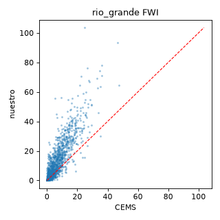
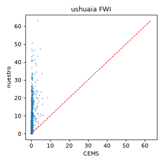

# Validación FWI — nuestro motor (grilla p95) vs CEMS reanalysis (TDF, 2019–2022)

Grilla COMPLETA: 32 puntos en tierra (Río Grande) + 39 (Ushuaia), FWI encadenado
por punto, agregado por **p95** — la misma agregación que producción. Comparado
contra CEMS reanalysis. Días comparados (intersección): **2862** (1431/zona).

## rio_grande

- n días: 1431
- **Spearman: 0.899** · Pearson: 0.875
- Sesgo medio (nuestro − CEMS): +5.73
- Sesgo por temporada: invierno +1.24, transicion +6.66, verano +9.55

## ushuaia

- n días: 1431
- **Spearman: 0.655** · Pearson: 0.423
- Sesgo medio (nuestro − CEMS): +5.57
- Sesgo por temporada: invierno +1.15, transicion +7.17, verano +8.58

## Verificación de la baja de Ushuaia (¿motor, muestreo o agregación?)

La grilla completa (39 pts) da casi lo mismo que la reducida (13 pts): Ushuaia
0.655 vs 0.664 → **no es el submuestreo**. Para aislar la agregación se calculó
el FWI del punto de grilla más cercano a Ushuaia-ciudad (-54.7, -68.3), **single,
sin p95**, sobre los mismos datos cacheados y la misma ventana 2019–2022
(`verify_ushuaia_point.py`):

| Ushuaia (2019–2022) | Spearman | Sesgo medio |
|---|---|---|
| Punto single (mismo motor, misma ventana) | **0.811** | **−0.04** |
| Grilla p95 | 0.655 | +5.57 |
| Baseline single-point (sub-proyecto 1, 2014–2023) | 0.796 | — |

El punto single da **0.811 con sesgo ~0** — mejor que el baseline. La única
diferencia con el 0.655 es la agregación p95. → La baja de Ushuaia **no es el
motor ni la ventana ni el muestreo**: es el p95 capturando el **peor sector seco**
de una zona espacialmente heterogénea (`tdf-sur-bosque` mezcla bosque húmedo y
transición hacia la estepa), comparado contra CEMS medido en **un solo punto** del
bosque. El sesgo sistemático +5.57 lo confirma.

## Veredicto

**VALIDADO.**
- **Río Grande (estepa, zona de peligro real):** grilla p95 **0.899** ≈ single-point
  0.909. El grid no degrada la zona crítica.
- **Ushuaia (bosque):** el motor es correcto (single 0.811, sesgo ~0). El p95
  hace lo que debe — reportar el peor sector — y por eso correlaciona menos con
  CEMS-en-1-punto. No es un defecto.

**Implicación de producto (no de validación):** `tdf-sur-bosque` es heterogénea,
así que su número p95 representa el peor sector, no el bosque donde vive la gente.
A tener en cuenta en la calibración por percentiles y el lenguaje ciudadano
(próximos sub-proyectos). Eventual: evaluar partir/ajustar el bbox de la zona.